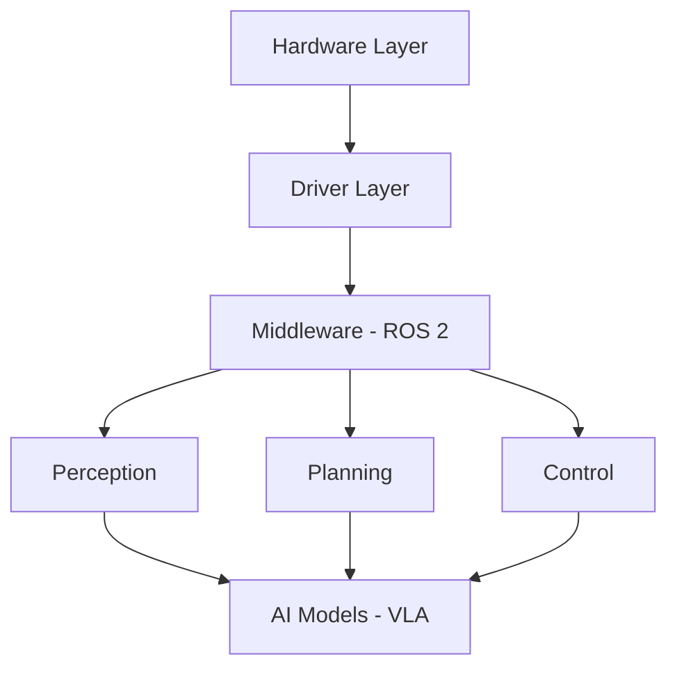

# Physical AI Fundamentals

## What Makes Physical AI Different?

Physical AI systems must handle challenges that pure software AI never encounters:

### 1. **Real-Time Constraints**
- **Latency matters**: A self-driving car must react in milliseconds
- **Deadline-driven**: Control loops run at 100Hz+
- **Resource-limited**: Embedded systems have limited compute

### 2. **Uncertainty in Sensing**
- **Noisy sensors**: Camera images have motion blur, compression artifacts
- **Partial observability**: Sensors have limited fields of view
- **Sensor fusion**: Combining LIDAR + Camera + IMU for robust perception

### 3. **Safety-Critical Operations**
- **Hardware can break**: Motors fail, batteries die
- **Environments are unpredictable**: Humans enter robot workspaces
- **Failure modes**: Graceful degradation vs catastrophic failure

## The Physical AI Stack

### Layer Breakdown

1. **Hardware**: Motors, sensors, compute (Jetson, RTX GPU)
2. **Drivers**: Low-level interfaces to hardware
3. **Middleware**: ROS 2 - communication backbone
4. **Perception**: Computer vision, object detection
5. **Planning**: Path planning, task planning
6. **Control**: PID loops, trajectory execution
7. **AI Models**: Vision-Language-Action models for high-level reasoning

## Key Concepts

### Digital Twin

A **digital twin** is a virtual replica of a physical robot used for:

- **Testing**: Validate code before deploying to hardware
- **Training**: Generate synthetic data for ML models
- **Visualization**: Debug sensor data and robot state

**Tools**: Gazebo, NVIDIA Isaac Sim

### Embodied AI

AI that interacts with the physical world through sensors and actuators.

**Examples:**
- Humanoid robots (Tesla Optimus, Figure 01)
- Autonomous vehicles
- Warehouse robots (Amazon Robotics)

### Vision-Language-Action (VLA) Models

Models that:

1. **Perceive** the environment (Vision)
2. **Understand** natural language commands (Language)
3. **Generate** robot actions (Action)

**Example:** "Pick up the red mug from the table" → Robot action sequence

## Why ROS 2?

**ROS 2** (Robot Operating System 2) is the industry standard for robotics software because:

- **Modularity**: Nodes communicate via standard interfaces
- **Language agnostic**: Python, C++, Rust supported
- **Ecosystem**: 1000+ packages for common robotics tasks
- **Real-time capable**: DDS middleware supports deterministic communication

## Physical AI Applications

1. **Manufacturing**: Collaborative robots (cobots) for assembly
2. **Logistics**: Autonomous mobile robots for warehouses
3. **Healthcare**: Surgical robots, rehabilitation assistants
4. **Agriculture**: Autonomous tractors, crop monitoring drones
5. **Humanoid Services**: Hotel receptionists, eldercare assistants

## Next Steps

Continue to [Course Structure](./course-structure.md) for a detailed breakdown of the 13-week curriculum.
