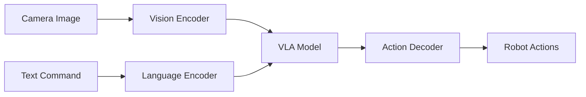

# Week 11: Vision-Language-Action (VLA) Models

## What are VLA Models?

VLA models combine:
- **Vision**: Understanding scenes from camera images
- **Language**: Processing natural language commands
- **Action**: Generating robot control actions

## Architecture



## Example: RT-2 (Robotics Transformer 2)

```python
from transformers import RT2ForConditionalGeneration, RT2Processor

processor = RT2Processor.from_pretrained("google/rt-2-base")
model = RT2ForConditionalGeneration.from_pretrained("google/rt-2-base")

# Process inputs
image = camera.capture()
text = "pick up the red cup"
inputs = processor(images=image, text=text, return_tensors="pt")

# Generate actions
outputs = model.generate(**inputs)
actions = processor.decode_actions(outputs)

# Execute
robot.execute_actions(actions)
```

## Training VLA Models

1. **Collect demonstrations**: Teleoperate robot, record (image, text, action) tuples
2. **Train**: Fine-tune pretrained VLA on your data
3. **Deploy**: Run inference on robot

## Key Takeaways

VLA models enable natural language robot control.

## Next: [Week 12: Humanoid Basics](./week-12-humanoid-basics.md)
