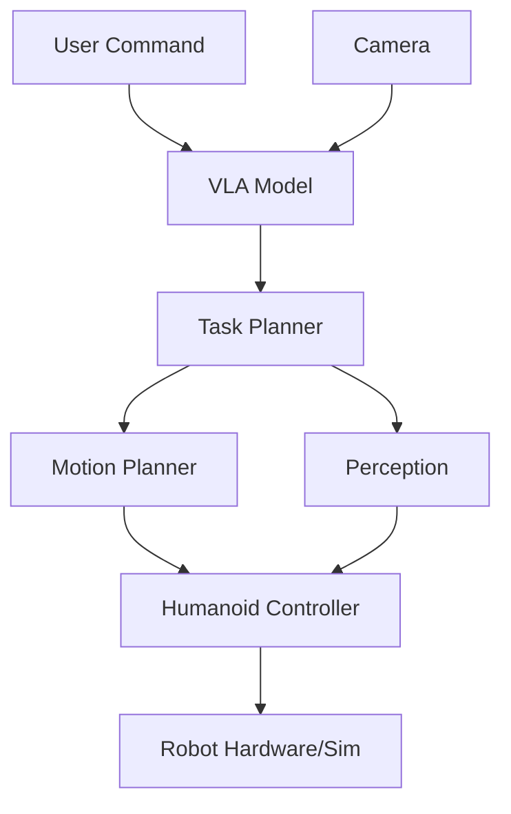

# Week 13: Full System Integration

## Capstone Project: Autonomous Humanoid

Build a system that combines:
- **ROS 2**: Communication backbone
- **Gazebo/Isaac**: Simulation
- **Perception**: Vision pipelines
- **VLA**: Natural language control
- **Humanoid**: Bipedal mobility

## System Architecture



## Implementation Steps

1. **Set up ROS 2 workspace** with all packages
2. **Configure simulation** (Gazebo or Isaac)
3. **Integrate VLA model** for command processing
4. **Implement perception pipeline** for object detection
5. **Add motion planning** for navigation and manipulation
6. **Test end-to-end** with sample tasks

## Example Integration

```python
class AutonomousHumanoid:
    def __init__(self):
        self.vla = VLAModel()
        self.perception = PerceptionSystem()
        self.planner = MotionPlanner()
        self.controller = HumanoidController()
        
    def execute_command(self, text_command):
        # Get current scene
        image = self.camera.capture()
        
        # VLA generates high-level plan
        plan = self.vla.generate_plan(image, text_command)
        
        # Execute plan steps
        for step in plan:
            if step.type == "navigate":
                self.navigate_to(step.target)
            elif step.type == "pick":
                obj = self.perception.detect_object(step.object_name)
                self.pick_object(obj)
            elif step.type == "place":
                self.place_object(step.location)
                
    def navigate_to(self, target):
        path = self.planner.plan_path(target)
        self.controller.follow_path(path)
```

## Capstone Assessment

Complete the [Capstone Project Assessment](/docs/assessments/capstone-project) demonstrating all course skills.

## Congratulations!

You've completed the Physical AI & Humanoid Robotics course. You now have the skills to build production robotics systems.

## Next Steps

- **Join robotics communities**: ROS Discourse, Isaac Sim forums
- **Contribute to open source**: ROS 2 packages
- **Build projects**: Share on GitHub
- **Stay updated**: Follow robotics research (CoRL, ICRA, RSS)
